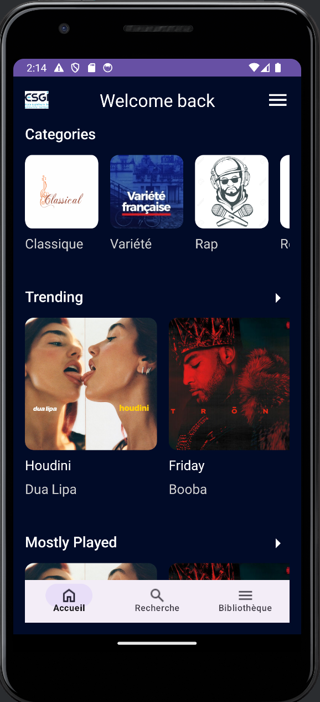
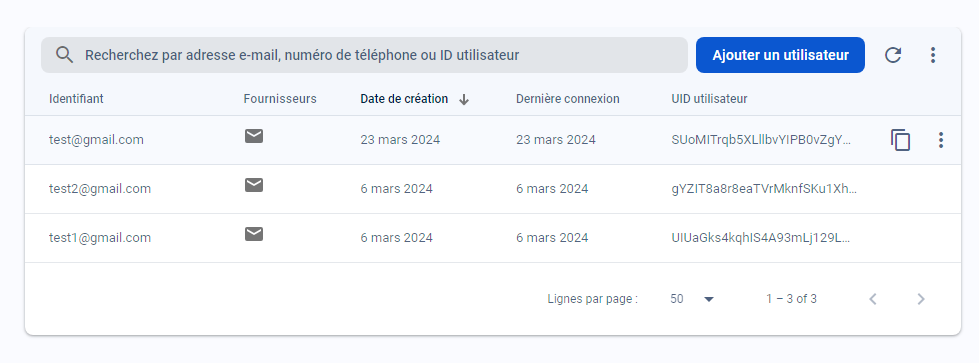
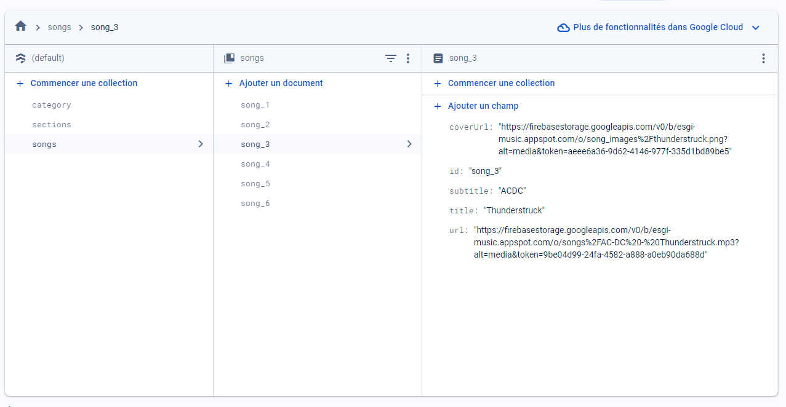
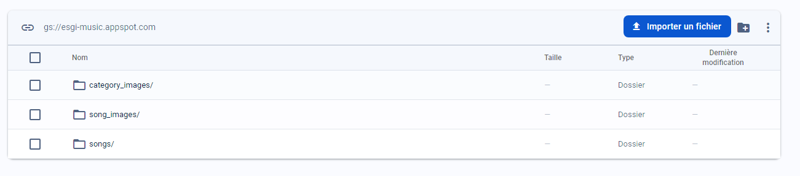

# ESGI Music

## Description

ESGI Music est une application Android conçue pour permettre aux utilisateurs de parcourir, rechercher et écouter une variété de musiques, et même d'enregistrer ses propres sons. 
L'application utilise Kotlin comme langage de programmation principal et Firebase pour le stockage en ligne, la gestion de la base de données et l'authentification des utilisateurs.

## Fonctionnalités

- **Authentification** : Les utilisateurs peuvent se connecter et s'inscrire pour accéder à l'application.
- **Navigation principale** : Après la connexion, les utilisateurs sont accueillis par la `MainActivity`, qui sert de hub pour les différentes fonctionnalités de l'app.
- **Lecture de musique** : Les utilisateurs peuvent écouter de la musique à partir de la `PlayerActivity`, qui affiche des informations sur la chanson en cours de lecture.
- **Liste des chansons** : La `SongsListActivity` affiche une liste de chansons disponibles dans une catégorie ou section spécifique.
- **Bibliothèque** : La `LibraryActivity` permet aux utilisateurs de parcourir les différentes catégories de musique disponibles.
- **Recherche** : La `SearchActivity` offre aux utilisateurs la possibilité de rechercher des chansons par titre.

## Architecture

### Activities

- **LoginActivity** : Gère l'authentification des utilisateurs.
- **SignUpActivity** : Permet aux nouveaux utilisateurs de créer un compte.
- **MainActivity** : L'écran principal qui sert de point d'entrée pour les principales fonctionnalités de l'application.
- **PlayerActivity** : Un lecteur de musique pour écouter les chansons.
- **SongsListActivity** : Affiche une liste de chansons d'une catégorie ou section spécifique.
- **LibraryActivity** : Permet aux utilisateurs de parcourir les catégories de musique disponibles.
- **SearchActivity** : Permet aux utilisateurs de rechercher des chansons.

### Adapters

- **CategoryAdapter** : Gère l'affichage des catégories de musique dans un RecyclerView.
- **SearchResultsAdapter** : Affiche les résultats de la recherche dans un RecyclerView.
- **SongsListAdapter** : Affiche une liste de chansons dans un RecyclerView.

### Modèles

- **CategoryModel** : Représente les catégories de musique.
- **SongsModel** : Contient les informations sur les chansons.

## Firebase

- **Firebase Authentication** : Utilisé pour l'authentification des utilisateurs.

- **Firebase Firestore** : Une base de données NoSQL pour stocker les informations sur les chansons, catégories et sections.

- **Firebase Storage** : Utilisé pour stocker les fichiers de musique et les images (couvertures des chansons et catégories).

## Configuration et déploiement

1. **Configurer Firebase** : Créez un projet Firebase et configurez-le avec votre application Android en suivant les instructions de la documentation Firebase.
2. **Intégration Firebase dans l'application** : Ajoutez les dépendances nécessaires pour Firebase Authentication, Firestore et Storage dans votre fichier `build.gradle`.
3. **Initialisation des services Firebase** : Initialisez Firebase Authentication, Firestore et Storage dans votre application.
4. **Déploiement** : Une fois l'application développée et testée, vous pouvez la déployer sur Google Play Store pour la rendre accessible aux utilisateurs.

## Auteur

-Aurélien (https://github.com/nandreau)

-Bertrand (https://github.com/Bertrand2808)

---

